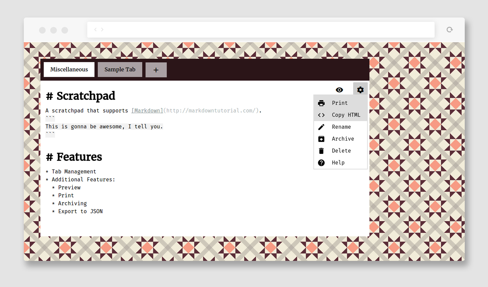

# scratchpad-markdown
Browser based scratchpad that supports live formatted markdown and autosaves notes in localStorage.

It uses [an embeddable markdown editor](https://github.com/sparksuite/simplemde-markdown-editor/) by [@Sparksuite](https://github.com/sparksuite/).

## Features
* Manage multiple notes in tab form (basic operations: add, delete, rename)
* Preview the markdown (convert to HTML)
* Print a note preview
* Copy HTML of the preview
* Archive & Unarchive notes
* Export all archived and unarchived notes in a JSON (press <kbd>ctrl</kbd>+<kbd>s</kbd> or <kbd>cmd</kbd>+<kbd>s</kbd>)
* Current time displayed in page title

## License
This project is licensed under the standard MIT License.
